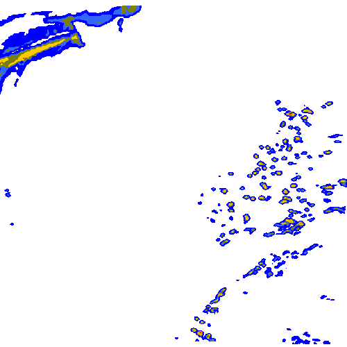
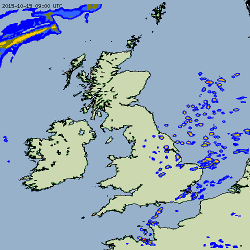

# met-office-weather-maps

Copyright © 2015 Wayne D Grant

Licensed under the MIT License

API to fetch weather maps from the [Met Office](http://www.metoffice.gov.uk) using their [DataPoint](http://www.metoffice.gov.uk/datapoint) web services. Written in PHP.

## Overview

The [Met Office](http://www.metoffice.gov.uk) provide the [DataPoint](http://www.metoffice.gov.uk/datapoint) API which exposes web services that, among other capabilities, allow clients to request a wide selection of time series weather maps for the UK as images.

These maps make a great addition to any UK-centric weather website. However, there are several common issues the API's users may have to overcome:

1. Most of the map images are simple layers with no UK map. Users have to supply their own UK base and/or overlay map images that conform to the required boundary box.
2. DataPoint has fair use call limits and map types can have very different update schedules. Users have to create call schedules that keep their website's maps up-to-date but do not exceed the fair use call limit.
3. All of the maps are available as a time series. However, there is no option to request an animated image that combines an entire time series.
4. Most of the map images are simple layers with no visual indication as to what time they are relevant for.
5. A large collection of map images can be quite large and bandwidth intensive when referred to directly from a hosting web page.

**met-office-weather-maps** solves each of these issues:

1. Map images available only as simple layers are processed by **met-office-weather-maps** which adds appropriate UK base and/or overlay images for the required boundary box.
2. **met-office-weather-maps** queries DataPoint's capabilities API and caches the timestamps of all web service calls so that it only fetches map images when new versions are available. This greatly reduces the number of DataPoint web service calls even if **met-office-weather-maps** is called on a frequent schedule.
3. **met-office-weather-maps** automatically creates a GIF animation of each map time series it fetches.
4. Where map images are not timestamped **met-office-weather-maps** automatically adds a UTC date/time to the top-left corner.
5. **met-office-weather-maps** automatically creates thumbnails of all map images.

For example, when this raw layer for precipitation is fetched from DataPoint:



**met-office-weather-maps** will create a processed image similar to:



and an animated GIF for the entire time series of precipitation images:


The original use case for **met-office-weather-maps** was as a scheduled job to keep the weather maps on my own weather web site up-to-date. The following instructions concentrate on this particular scenario.

For more examples of **met-office-weather-maps** in action see [http://www.waynedgrant.com/weather](http://www.waynedgrant.com/weather/maps.html).

## Requirements

1. [DataPoint](http://www.metoffice.gov.uk/datapoint) API key (available for free)
2. PHP version 5.5 or above installed on a web server

## Installation

These instructions can be followed to set up **met-office-weather-maps** on a regular schedule on a generic LAMP stack web server.

* Download the source code for the [latest release](https://github.com/waynedgrant/met-office-weather-maps/releases) and unzip it
* Retrieve a copy of [GifCreator.php](https://github.com/Sybio/GifCreator/blob/master/src/GifCreator/GifCreator.php) by **Clément Guillemain** and place it in the unzipped **met-office-weather-maps/src** directory
* Write a harness in PHP to fetch the maps you require (see **API** and **Example Harness** below and pay heed to the advice in **Fair Use Notes**)
* Upload all files in **met-office-weather-maps/src** and your **harness** to a directory on your web server
* Set up a cron schedule to kick off your harness regularly (e.g every 15 minutes)

## API

| PHP Class                          | Image Formats | DataPoint Reference                                                            |
|------------------------------------|---------------|--------------------------------------------------------------------------------|
| CloudCoverAndRainfallForecastMap   | gif, png      | N/A                                                                            |
| CloudCoverForecastMap              | gif, png      | http://www.metoffice.gov.uk/datapoint/product/cloud-cover-forecast-map-layer   |
| InfraredSatelliteObservationMap    | gif, png      | http://www.metoffice.gov.uk/datapoint/product/satellite-infrared-map-layer     |
| LightningObservationMap            | gif, png      | http://www.metoffice.gov.uk/datapoint/product/lightning-strike-map-layer       |
| RainfallForecastMap                | gif, png      | http://www.metoffice.gov.uk/datapoint/product/precipitation-forecast-map-layer |
| RainfallObservationMap             | gif, png      | http://www.metoffice.gov.uk/datapoint/product/rainfall-radar-map-layer         |
| SurfacePressureExtendedForecastMap | gif           | http://www.metoffice.gov.uk/datapoint/product/surface-pressure-charts          |
| SurfacePressureForecastMap         | gif, png      | http://www.metoffice.gov.uk/datapoint/product/pressure-forecast-map-layer      |
| TemperatureForecastMap             | gif, png      | http://www.metoffice.gov.uk/datapoint/product/temperature-forecast-map-layer   |
| VisibleSatelliteObservationMap     | gif, png      | http://www.metoffice.gov.uk/datapoint/product/satellite-visible-map-layer      |

All class constructors take the same two mandatory parameters:

* __apiKey__ Your DataPoint API Key
* __workingFolder__ The folder to output map images to. Note each class instance must use a different working folder or their output will clash

After construction of any of the classes simply call the **fetch()** method on it to fetch all images for the given map. After a successful fetch the **workingFolder** will contain the following files:

* __timestamp.txt__ cached timestamp file
* __0.png ... n.png__ latest time series images for map in png format and in time order
* __0-thumbnail.png ... n-thumbnail.png__ latest time series image thumbnails for map in png format and in time order
* __0.gif ... n.gif__ latest time series images for map in gif format and in time order
* __0-thumbnail.gif ... n-thumbnail.gif__ latest time series image thumbnails for map in gif format and in time order
* __animated.gif__ animated gif of all time series images with a two second frame rate

## Example Harness

This example harness code will fetch all available maps into separate folders (replace with your own DataPoint API Key).

```php
<?php

require_once('CloudCoverAndRainfallForecastMap.php');
require_once('CloudCoverForecastMap.php');
require_once('InfraredSatelliteObservationMap.php');
require_once('LightningObservationMap.php');
require_once('RainfallForecastMap.php');
require_once('RainfallObservationMap.php');
require_once('SurfacePressureExtendedForecastMap.php');
require_once('SurfacePressureForecastMap.php');
require_once('TemperatureForecastMap.php');
require_once('VisibleSatelliteObservationMap.php');

define(API_KEY, 'aaaaaaaa-bbbb-cccc-dddd-eeeeeeeeeeee');

$dirName = dirname(__FILE__ );

$maps = array(
    new CloudCoverAndRainfallForecastMap(API_KEY, $dirName . '/cloud-rain-fcast'),
    new CloudCoverForecastMap(API_KEY, $dirName . '/cloud-fcast'),
    new InfraredSatelliteObservationMap(API_KEY, $dirName . '/ir-sat-obs'),
    new LightningObservationMap(API_KEY, $dirName . '/lightning-obs'),
    new RainfallForecastMap(API_KEY, $dirName . '/rain-fcast'),
    new RainfallObservationMap(API_KEY, $dirName . '/rain-obs'),
    new SurfacePressureExtendedForecastMap(API_KEY, $dirName . '/ext-pressure-fcast'),
    new SurfacePressureForecastMap(API_KEY, $dirName . '/pressure-fcast'),
    new TemperatureForecastMap(API_KEY, $dirName . '/temp-fcast'),
    new VisibleSatelliteObservationMap(API_KEY, $dirName . '/vis-sat-obs'));

foreach ($maps as $map) {
    $map->fetch();
}

?>
```

## Fair Use Notes

At the time of writing the [DataPoint Terms and Conditions](http://www.metoffice.gov.uk/datapoint/terms-conditions) state fair use for a single API Key is up to 5,000 web service calls a day and up to 100 calls in a single minute.

Calling the above Example Harness (which request all maps) every 15 minutes will result in less than 4,000 daily calls due to **met-office-weather-map's** caching. However, it is possible that the same code could make a little more than 100 calls in a minute at times when new versions of all maps become available simultaneously and if your web server is especially fast.

Given this I would advise users not to request all maps as above but instead only what they need. This will prevent their account from being banned. This should not pose an issue for most use cases given the similarity of some of the maps (e.g. CloudCoverAndRainfallForecastMap vs CloudCoverForecastMap & RainfallForecastMap, SurfacePressureExtendedForecastMap vs SurfacePressureForecastMap).
