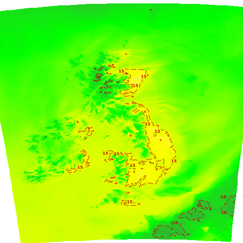

# met-office-weather-maps

Copyright © 2015 Wayne D Grant

Licensed under the MIT License

API to fetch weather maps from the [Met Office](http://www.metoffice.gov.uk) using their [DataPoint](http://www.metoffice.gov.uk/datapoint) web services. Written in PHP.

## Overview

The [Met Office](http://www.metoffice.gov.uk) provide the [DataPoint](http://www.metoffice.gov.uk/datapoint) API which exposes web services that, among other capabilities, allows clients to request a wide selection of time series weather maps for the UK as images.

These maps make a great addition to any UK-centric weather website. However, there are several common issues the API's users may have to overcome:

1. Most of the map images are simple layers with no UK map. Users have to supply their own UK base and/or overlay map images that conform to the required boundary box.
2. Most of the map images have no visual indication as to what time they are relevant for.
3. DataPoint has fair use call limits and map types can have very different update schedules. Users have to create call schedules that keep their website's maps up-to-date but do not exceed the fair use call limit.

**met-office-weather-maps** solves each of these issues:

1. Map images available only as simple layers are processed by **met-office-weather-maps** which adds appropriate UK base and/or overlay images for the required boundary box.
2. Where map images are not timestamped **met-office-weather-maps** automatically adds the relevant UK date/time to the top-left corner.
3. **met-office-weather-maps** queries DataPoint's capabilities API and caches the timestamps of all web service calls so that it only fetches map images when new versions are available. This greatly reduces the number of DataPoint web service calls even if **met-office-weather-maps** is called on a frequent schedule.

## Examples

### Surface Pressure Forecast Map

Raw layer fetched from DataPoint:


**met-office-weather-maps** processed image:


### Visible Satellite Observation Map

Raw layer fetched from DataPoint:


**met-office-weather-maps** processed image:


### Temperature Forecast Map

Raw layer fetched from DataPoint:



**met-office-weather-maps** processed image:


### Cloud Cover and Rainfall Forecast Map

Raw layer fetched from DataPoint:


**met-office-weather-maps** processed image:


### More Examples

For more examples of **met-office-weather-maps** in action see [http://www.waynedgrant.com/weather/maps.html](http://www.waynedgrant.com/weather/maps.html).

## Requirements

1. [DataPoint](http://www.metoffice.gov.uk/datapoint) API key (available for free)
2. PHP version 5.5 or above installed on a web server

## Installation

These instructions can be used to set up **met-office-weather-maps** on a regular schedule on a generic LAMP stack web server.

* Download the source code for the [latest release](https://github.com/waynedgrant/met-office-weather-maps/releases) and unzip it
* Write code in PHP to fetch the maps you require (see **API** and **Example Code** below and pay heed to the advice in **DataPoint Fair Use Notes**)
* Upload all files in **met-office-weather-maps/src** and your code to a directory on your web server
* Set up a cron schedule to kick off your code regularly (e.g every 15 minutes)

## API

The following PHP classes are available with corresponding to a map available from DataPoint:

| PHP Class                          | DataPoint Reference                                                                                        |
|------------------------------------|------------------------------------------------------------------------------------------------------------|
| CloudCoverAndRainfallForecastMap   | N/A                                                                                                        |
| CloudCoverForecastMap              | [Total cloud cover forecast](http://www.metoffice.gov.uk/datapoint/product/cloud-cover-forecast-map-layer) |
| InfraredSatelliteObservationMap    | [Infrared satellite](http://www.metoffice.gov.uk/datapoint/product/satellite-infrared-map-layer)           |
| LightningObservationMap            | [Lightning strikes](http://www.metoffice.gov.uk/datapoint/product/lightning-strike-map-layer)              |
| RainfallForecastMap                | [Precipitation forecast](http://www.metoffice.gov.uk/datapoint/product/precipitation-forecast-map-layer)   |
| RainfallObservationMap             | [Rainfall radar](http://www.metoffice.gov.uk/datapoint/product/rainfall-radar-map-layer)                   |
| SurfacePressureExtendedForecastMap | [Surface pressure charts](http://www.metoffice.gov.uk/datapoint/product/surface-pressure-charts)           |
| SurfacePressureForecastMap         | [Pressure forecast](http://www.metoffice.gov.uk/datapoint/product/pressure-forecast-map-layer)             |
| TemperatureForecastMap             | [Temperature forecast](http://www.metoffice.gov.uk/datapoint/product/temperature-forecast-map-layer)       |
| VisibleSatelliteObservationMap     | [Visible satellite](http://www.metoffice.gov.uk/datapoint/product/satellite-visible-map-layer)             |

All class constructors take the same two mandatory parameters:

* __apiKey__ Your DataPoint API Key
* __workingFolder__ The folder to output map images to. Note each class instance must use a different working folder or their outputs will overwrite each other

After construction of any of the classes simply call the **fetch()** method on it to fetch all images for the given map. After a successful fetch the **workingFolder** (which will be created automatically if necessary) will contain the following files:

* __0.png ... n.png__ or __0.gif ... n.gif__ - time series images for map in time order
* __info.json__ - JSON formatted description of the fetched map (see below)

### info.json

The __info.json__ for a map can be used to dynamically build an HTML web page to host it using, for example, JQuery. The __info.json__ file contains the following fields:

| Field                | Description                                                                                                                      |
|----------------------|-----------------------------------------------------------------------------------------------------------------------------------|
| name                 | Map name                                                                                                                          |
| datapoint_timestamp  | Map creation timestamp originally returned by Datapoint                                                                           |
| base_time            | Map base time: YYYY-MM-DD hh:mm UTC                                                                                               |
| images               | Array of time series image details (in increasing time order for forecast maps and decreasing time order for observation maps) |
| images.file          | Image file name                                                                                                                   |
| images.width         | Image width in pixels                                                                                                             |
| images.height        | Image height in pixels                                                                                                            |
| images.time          | Image time: YYYY-MM-DD hh:mm UTC                                                                                                  |
| images.timestep_mins | Image timestep relative to base_time in minutes (0 or positive value for forecast maps, 0 or negative value for observation maps) |

For example, this snippet of a __info.json__ file:

```
{
    "name": "Rainfall Observation Map",
    "datapoint_timestamp" : "2015-11-14T08:30:00",
    "base_time": "2015-11-14 08:30 UTC",
    "images":
    [
        {
            "file": "0.png",
            "width": 500,
            "height": 500,
            "time": "2015-11-14 08:30 UTC",
            "timestep_mins": 0
        },
        {
            "file": "1.png",
            "width": 500,
            "height": 500,
            "time": "2015-11-14 08:15 UTC",
            "timestep_mins": -15
        },
        ... etc ...
    ]
}
```

## Example Code

This example code will fetch a selection of maps into separate folders under **fetched** (replace with your own DataPoint API Key).

```php
<?php

require_once('CloudCoverAndRainfallForecastMap.php');
require_once('InfraredSatelliteObservationMap.php');
require_once('RainfallObservationMap.php');
require_once('SurfacePressureExtendedForecastMap.php');
require_once('TemperatureForecastMap.php');
require_once('VisibleSatelliteObservationMap.php');

define(API_KEY, 'aaaaaaaa-bbbb-cccc-dddd-eeeeeeeeeeee');

$fetchFolderName = dirname(__FILE__ ) . '/fetched/';

$maps = array(
    new CloudCoverAndRainfallForecastMap(API_KEY, $fetchFolderName . 'cloud-rain-fcast'),
    new InfraredSatelliteObservationMap(API_KEY, $fetchFolderName . 'ir-sat-obs'),
    new RainfallObservationMap(API_KEY, $fetchFolderName . 'rain-obs'),
    new SurfacePressureExtendedForecastMap(API_KEY, $fetchFolderName . 'ext-pressure-fcast'),
    new TemperatureForecastMap(API_KEY, $fetchFolderName . 'temp-fcast'),
    new VisibleSatelliteObservationMap(API_KEY, $fetchFolderName . 'vis-sat-obs'));

foreach ($maps as $map) {
    $map->fetch();
}

?>
```

## DataPoint Fair Use Notes

At the time of writing the [DataPoint Terms and Conditions](http://www.metoffice.gov.uk/datapoint/terms-conditions) state fair use for a single API Key is up to 5,000 web service calls a day and up to 100 calls in a single minute.

Calling code that requests all map types every 15 minutes will result in less than 4,000 daily calls (a smaller number than it would be otherwise because of **met-office-weather-map's** caching). However, it is possible that the same code could make more than 100 calls in a minute at times when new versions of all maps become available simultaneously and if your web server is especially fast.

Given this I would advise **met-office-weather-map's** users not to request all maps as above but instead only what they need. This will prevent their DataPoint account from being banned. This should not pose an issue for most use cases given the similarity of some of the maps (e.g. CloudCoverAndRainfallForecastMap vs CloudCoverForecastMap & RainfallForecastMap, SurfacePressureExtendedForecastMap vs SurfacePressureForecastMap).

## Image Reference

### Base and Overlay Map Images

| PHP Class                          | Base Map Image    | Overlay Map Image                |
|------------------------------------|-------------------|----------------------------------|
| CloudCoverAndRainfallForecastMap   | uk base colour    | uk overlay black full outline    |
| CloudCoverForecastMap              | uk base colour    | uk overlay black full outline    |
| InfraredSatelliteObservationMap    | N/A               | uk overlay yellow cutout outline |
| LightningObservationMap            | uk base greyscale | N/A                              |
| RainfallForecastMap                | uk base colour    | uk overlay black full outline    |
| RainfallObservationMap             | uk base colour    | uk overlay black full outline    |
| SurfacePressureExtendedForecastMap | N/A               | N/A                              |
| SurfacePressureForecastMap         | uk base colour    | N/A                              |
| TemperatureForecastMap             | uk base colour    | uk overlay black full outline    |
| VisibleSatelliteObservationMap     | N/A               | uk overlay yellow cutout outline |

### Output Map Image Formats and Sizes

| PHP Class                          | Format | Width/Height |
|------------------------------------|--------|--------------|
| CloudCoverAndRainfallForecastMap   | png    | 500, 500     |
| CloudCoverForecastMap              | png    | 500, 500     |
| InfraredSatelliteObservationMap    | png    | 500, 500     |
| LightningObservationMap            | png    | 500, 500     |
| RainfallForecastMap                | png    | 500, 500     |
| RainfallObservationMap             | png    | 500, 500     |
| SurfacePressureExtendedForecastMap | gif    | 891, 601     |
| SurfacePressureForecastMap         | png    | 500, 500     |
| TemperatureForecastMap             | png    | 500, 500     |
| VisibleSatelliteObservationMap     | png    | 500, 500     |
